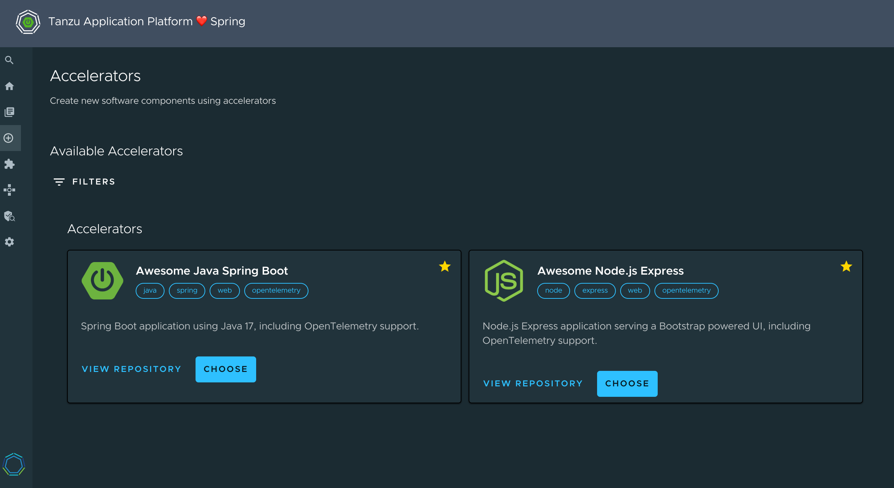

# Welcome to Awesome TAP Accelerators! 🌟

This repository is a collection of curated
[accelerators](https://docs.vmware.com/en/VMware-Tanzu-Application-Platform/1.7/tap/tap-gui-plugins-application-accelerator.html)
(aka project templates) for
[VMware Tanzu Application Platform](https://tanzu.vmware.com/application-platform).

> [!NOTE]
> Use these accelerators for your next project, and speed up your Kubernetes developer experience!

## How to use it?

Accelerators are defined in the [accelerators](accelerators) directory.

Depending on your configuration, you may have to create your own version of these
manifests (for instance: adding Git credentials).

Add this configuration block in your `tap-values.yaml`:

```yaml
accelerator:
  managed_resources:
    enable: true
    git:
      url: https://github.com/alexandreroman/awesome-tap-accelerators
      sub_path: accelerators
      ref: origin/main
```

The new accelerators should be available in your TAP instance:



Have fun!

## Contribute

Contributions are always welcome!

Feel free to open issues & send PR.

## License

Copyright &copy; 2024 [Broadcom, Inc. or its affiliates](https://www.broadcom.com/).

This project is licensed under the [Apache Software License version 2.0](https://www.apache.org/licenses/LICENSE-2.0).
