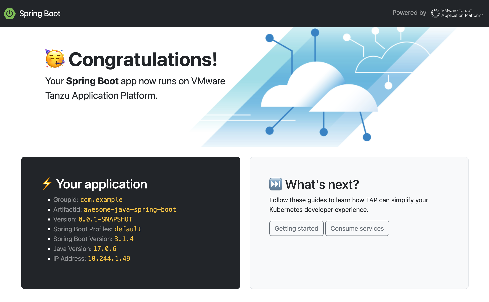

# Awesome Java Spring Boot Basic

This template relies on [Spring Boot](https://spring.io/projects/spring-boot)
to serve a [Bootstrap](https://getbootstrap.com/) backed UI.



This template is a stripped down version of the
[Awesome Spring Boot Accelerator](https://github.com/alexandreroman/awesome-tap-accelerators/tree/main/java-spring-boot).

It only serves a web UI and a simple REST API.

Using this template, you can create frontend apps in Java with
your favorite development framework.
Thanks to [Spring Boot Devtools](https://docs.spring.io/spring-boot/docs/current/reference/html/using.html#using.devtools),
you can build your app with live reloading: for example you see the result of editing
CSS/HTML files without having to restart the app.

## Prerequisites

You need the following tools to build and run this app:

- Java Development Kit 17+
- Maven 3.8+
- Tanzu CLI

## How to run this app?

Run this command to build and run the app on your workstation:

```shell
mvn spring-boot:run -Dspring-boot.run.profiles=dev
```

The app is available at http://localhost:8080.

## How to deploy this app?

Run this command to deploy this app to your developer namespace:

```shell
tanzu apps workload apply -f config/workload.yaml
```
