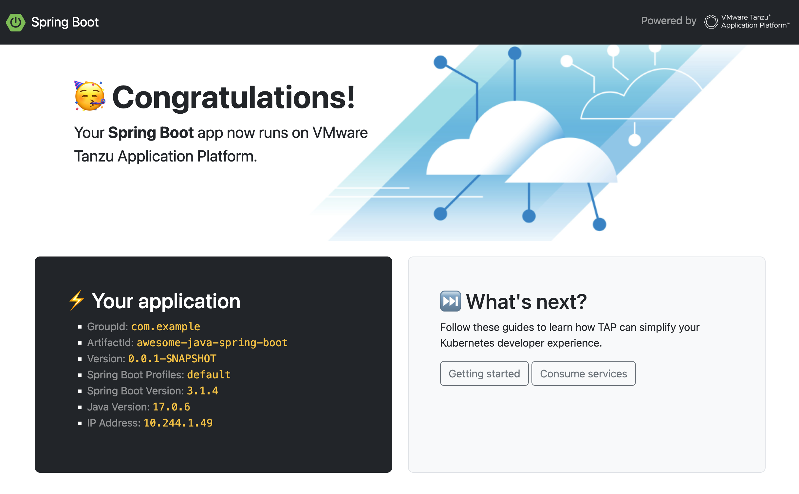

# Awesome Java Spring Boot

This template relies on [Spring Boot](https://spring.io/projects/spring-boot)
to serve a [Bootstrap](https://getbootstrap.com/) backed UI.



Using this template, you can create frontend apps in Java with
your favorite development framework.
Thanks to [Spring Boot Devtools](https://docs.spring.io/spring-boot/docs/current/reference/html/using.html#using.devtools),
you can build your app with live reloading: for example you see the result of editing
CSS/HTML files without having to restart the app.

It also provides a REST API,
featuring an [OpenAPI](https://www.openapis.org/) endpoint.
Metrics and tracing spans are available thanks to
[OpenTelemetry](https://opentelemetry.io/) support.

Simplify your developer experience with
[Testcontainers](https://testcontainers.com/) support:
no need to spin up a database on your workstation,
this framework takes care of creating such instances using OCI images - all you need is a Docker daemon running.

Finally, use [GraalVM](https://www.graalvm.org/) and build your app as a native image,
in order to get lower the memory footprint and dramatically speed up starting time.

## Prerequisites

You need the following tools to build and run this app:

- Java Development Kit 17+
- Maven 3.8+
- Tanzu CLI

## How to run this app?

Run this command to build and run the app on your workstation:

```shell
mvn spring-boot:run -Dspring-boot.run.profiles=dev
```

The app is available at http://localhost:8080.

Run this command to build a native image (powered by GraalVM):

```shell
mvn -Pnative native:compile
```

## How to deploy this app?

Run this command to deploy additional components
(such as app configuration or database instance):

```shell
kubectl apply -f config/app-operator
```

Run this command to deploy this app to your developer namespace:

```shell
tanzu apps workload apply -f config/workload.yaml
```

Run this command to build and deploy a native image (powered by GraalVM):

```shell
tanzu apps workload apply -f config/workload-native.yaml
```
