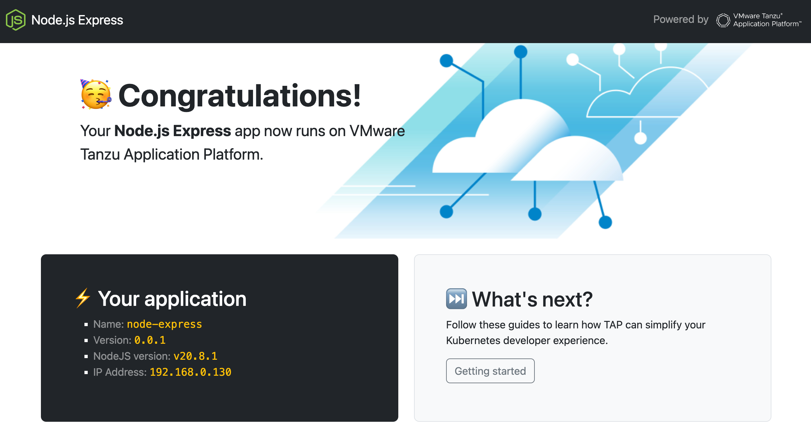

# Awesome Node.js Express

This template relies on [NodeJS](https://nodejs.org/)
and [Express](https://expressjs.com/)
to serve a [Bootstrap](https://getbootstrap.com/) backed UI.



Metrics and tracing spans are available thanks to
[OpenTelemetry](https://opentelemetry.io/) support.

## Prerequisites

You need the following tools to build and run this app:

- NodeJS 18+
- npm
- Tanzu CLI

## How to run the app?

Run this command to build and run the app:

```shell
npm install && npm start
```

The app is available at http://localhost:8080.

## How to deploy this app?

Run this command to deploy this app to your developer namespace:

```shell
tanzu apps workload apply -f config/workload.yaml
```
